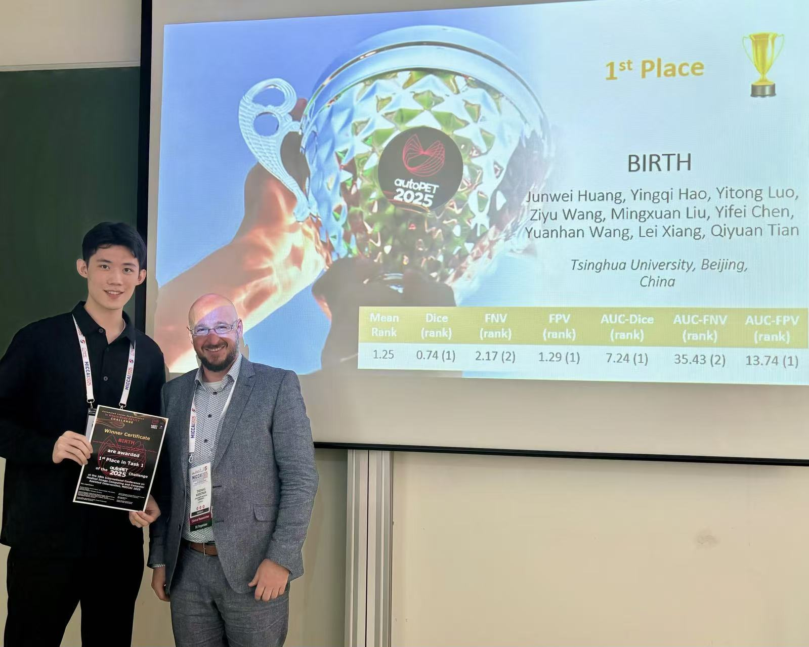
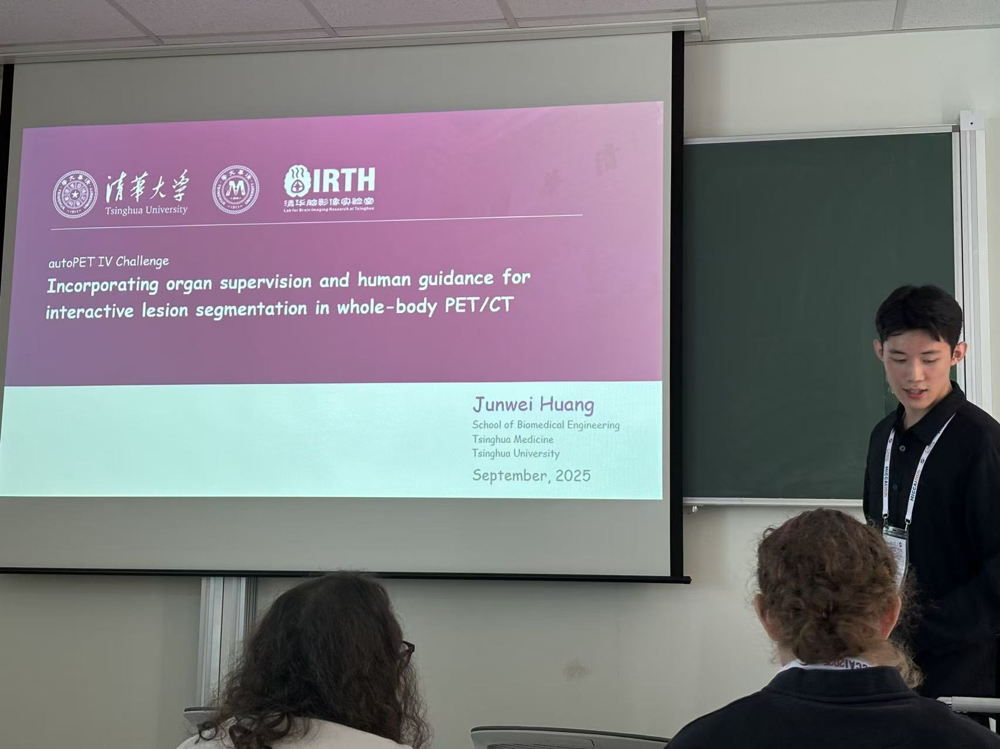








I'm Second-year PhD student from [School of Biomedical Engineering](https://www.med.tsinghua.edu.cn/en/), [Tsinghua University](https://www.tsinghua.edu.cn/). My research interest includes AI for Neuroscience, Medical Image Analysis, Spiking Neural Network.

I am very fortunate to be advised by [Prof. Qiyuan Tian](https://www.med.tsinghua.edu.cn/info/1143/2126.htm) of [Birth Lab](https://birthlab.github.io/) from [School of Biomedical Engineering](https://bme.tsinghua.edu.cn/index.htm), Tsinghua University. 

I was previously advised by [Prof. Hong Chen](http://hongchen.ime.tsinghua.edu.cn/) from [School of Integrated Circuits](https://www.sic.tsinghua.edu.cn/en/index.htm), Tsinghua University.

You can find my CV here: [Mingxuan Liu's Curriculum Vitae](https://drive.google.com/file/d/1_AdwP3kM8S54H9hw5yXXT3xNGdMc7l6u/view?usp=sharing).

Other related links: [Github](https://github.com/Arktis2022) / [Wechat](../images/wechat.jpg) / [Google scholar](https://scholar.google.com/citations?user=8VyGtD0AAAAJ&hl=zh-CN) / [Semantic scholar](https://www.semanticscholar.org/author/Mingxuan-Liu/2112213258).

# 📻 News
**2025.09.27:** 🏆 Our team won the **1st Place** in the [MICCAI 2025 autoPET IV Challenge](https://autopet-iv.grand-challenge.org/autopet-iv/) (Task I)!🎉 Thrilled to receive this award and present our method on the workshop!

  
  

**2025.07.22:** 🎉🎉 Our work about [Chest CT Foundation Model](https://openreview.net/forum?id=ns6nq592HX#discussion) won [the 1st prize](https://img.erpweb.eu.org/imgs/2025/07/126d96158b08e1d8.jpg) at the 10th National Biomedical Engineering Innovation Design Competition for College Students (Top 5%).

**2025.07.20:** Attended the [Medical Imaging Computing Seminar (MICS) 2025](http://mics2025.com/) in Cixi, Zhejiang. [Photo](https://drive.google.com/file/d/1MvW5ANSwRB1bYXC676vW0CCNSEsbHuGD/view?usp=sharing)

**2025.06.23:** Began my summer internship at [Subtle Medical Inc.](https://subtlemedical.com/) to explore the frontier of Medical AI.

**2025.02.17:** Delighted to join the [Lab for Brain Imaging Research at Tsinghua, BIRTH](https://birthlab.github.io/) and start working on Medical Image Analysis & AI for Healthcare.

**2024.09.16:** Honored to join the [Multi-Scale Robotics Lab](https://msrl.ethz.ch/) at ETH Zurich to develop biomedical micro robots.

**2024.09.11:** Arrived at Zurich! Excited to begin my exchange study journey in Switzerland.

# 📝 Publications 
# co-first author | * corresponding author   

<h2 id="CONFERENCE PAPERS" style="color: #2c4a88; padding-top: 60px; margin-top: -60px;">CONFERENCE PAPERS</h2>

<ol reversed>
  <li id="MA-Pub0"> 
    autoPET IV challenge: Incorporating organ supervision and human guidance for lesion segmentation in PET/CT  
    <a href="https://arxiv.org/pdf/2509.02402">[Paper]</a> <a href="https://github.com/huang-jw22/autoPET-4-submission/tree/master">[Code]</a>  
    Junwei Huang, Yingqi Hao, Yitong Luo, Ziyu Wang, Mingxuan Liu, Yifei Chen, Yuanhan Wang, Lei Xiang, Qiyuan Tian*  
    <i> MICCAI autoPET IV challenge <strong>(MICCAI). </strong></i> 2025. (Task I Winner Solution)
  </li>
</ol>

<h2 id="Manuscripts Under Review" style="color: #2c4a88; padding-top: 60px; margin-top: -60px;"> Manuscripts Under Review</h2>
  <li id="MA-Pub2"> 
    Automated Reconstruction and Segmentation of Isotropic-Resolution Fetal Body MRI Data for Quantitative Hydronephrosis Analysis  
    Junwei Huang, Junchen Zhu, Haoxiang Li, Hongjia Yang, Yijin Li, Mingxuan Liu, Fenglin Jia, Yi Liao, Haibo Qu, Qiyuan Tian*  
    <i>The ISMRM Workshop on Unlocking the Potential of Prenatal MRI</i>. 2025. (Under Review)
  </li>
  
</ol>

# 🎖 Honors and Awards
- [[Certificate]](https://img.erpweb.eu.org/imgs/2025/09/a3a62ea155b953e2.jpg) *2025* **MICCAI 2025 autoPET IV Challenge 1st Place Winner**
- [[Certificate]](https://img.erpweb.eu.org/imgs/2025/09/0b9b86976a2bfcf4.jpg) *2025* **MICCAI 2025 VLM3D Challenge 2nd Place Winner**
- [[Certificate]](https://drive.google.com/file/d/14UKWrfMNgwcnUKI7JWBR9Tb_3yyBKB15/view?usp=sharing) *2025* **2025 OHBM: Merit Abstract Award**
- [[Certificate]](https://arktis2022.github.io/) *2025* **2025 ISMRM: Educational Stipend Award**
- [[Certificate]](https://img.erpweb.eu.org/imgs/2025/03/735b20353752c284.jpg) *2024* **National Scholarship, Ministry of Education**, P.R. China   &nbsp; &nbsp; &nbsp; *Top scholarship in China. 0.2% domestically*.
- [[Certificate]](https://drive.google.com/file/d/1VYlwtxd4h-leijUuAW2cbnBj9PjgIWrQ/view?usp=sharing) *2024* **First Prize at 9th National Biomedical Engineering Innovation Design Competition for College Students (Top 5%)**   &nbsp; &nbsp; &nbsp; *A Deep Learning-Enabled Framework for Anomaly Detection in Fetal Brain MRI*
- [[Certificate]](https://img.erpweb.eu.org/imgs/2024/07/6cac5893381c31d0.jpg) *2024* **Outstanding Graduate of Beijing**
- [[Certificate]](https://img.erpweb.eu.org/imgs/2024/07/b8f175077893bf72.jpg) *2024* **Outstanding Graduate Award (Top 2%)**, Tsinghua University
- [[Certificate]](https://img.erpweb.eu.org/imgs/2024/06/f5785a7f202d1499.jpg) *2024* **2024 ISMRM Magna Cum Laude Merit Award (Top 15%)**
- [[Certificate]](https://mp.weixin.qq.com/s/Oy85Q203XVaCIvwvRs9wfA) *2024* **Second Prize at the 42nd "Challenge Cup" of Tsinghua University**   &nbsp; &nbsp; &nbsp; *Image Deblurring System Driven by Multimodal Data Augmentation*
- [[Certificate]](https://mp.weixin.qq.com/s/Oy85Q203XVaCIvwvRs9wfA) *2024* **Third Prize at the 42nd "Challenge Cup" of Tsinghua University**   &nbsp; &nbsp; &nbsp; *Automated Fetal MRI Image Processing and Anomaly Detection*
- [[Certificate]](https://arktis2022.github.io/) *2024* **2024 ISMRM: Educational Stipend Award**
- [[Certificate]](https://img.erpweb.eu.org/imgs/2024/12/0b64f5dd23685207.jpg) *2024* **2024 ICCBD+AI Best Paper Award**
- [[Certificate]](https://img.erpweb.eu.org/imgs/2024/02/207b20e0e675d4fa.jpg) *2023* **Top3 Prize in [Al Health Summit 2023 Poster Competition](https://healthsummit.ai/main/abstracts/)**, Singapore
- [[Certificate]](https://img.erpweb.eu.org/imgs/2025/03/1646fe4986f106aa.jpg) *2023* **National Scholarship, Ministry of Education**, P.R. China (Top 1 in department)   &nbsp; &nbsp; &nbsp; *Top scholarship in China. 0.2% domestically*.
- [[Certificate]](https://img.erpweb.eu.org/imgs/2024/06/3725764c812767de.jpg) *2022* **Scholarship for Academic Excellence**, Tsinghua University 
- [[Certificate]](https://img.erpweb.eu.org/imgs/2024/06/fa3e12191add4d53.jpg) *2022* **Scholarship for Science and Technology Innovation Excellence**, Tsinghua University 
- [[Certificate]](https://img.erpweb.eu.org/imgs/2024/06/de4438e28228284b.jpg) *2022* **Second Prize for Outstanding Projects of the Students Research Training Program**, Tsinghua University   &nbsp; &nbsp; &nbsp; *Supported by a National College Student Innovation and Entrepreneurship Project*
- [[Certificate]](https://img.erpweb.eu.org/imgs/2024/06/8593b53040f7c593.jpg) *2020* **Scholarship for Academic Excellence**, Tsinghua University 

# 📖 Educations
- *2024.09 - 2025.02*, Exchange student: **Department of Information Technology and Electrical Engineering**, ETH Zurich, Switzerland. 
- *2022.09 – present*, Undergraduate student: **Weixian College** and **School of Biomedical Engineering**, Tsinghua University, China.
  
# 📚 Book Reading
- *2025.05.01 – 2025.05.31*, [**The House on the Borderland**](https://en.wikipedia.org/wiki/The_House_on_the_Borderland) by William Hope Hodgson. [Book](https://img.erpweb.eu.org/imgs/2025/05/41a06bab3300e89d.jpg)
- *2025.05.31 – 2025.06.05*, [**Flatland: A Romance of Many Dimensions**](https://en.wikipedia.org/wiki/Flatland) by Edwin Abbott. [Book](https://img.erpweb.eu.org/imgs/2025/06/8361c5333a48077c.jpg)
- *2025.06.05 - 2025.07.26*, [**Holy Mother**](https://www.goodreads.com/book/show/32450412-holy-mother) by Rikako Akiyoshi. [Book](https://img.erpweb.eu.org/imgs/2025/07/1356a6d968539bc6.jpg)
- *2025.07.26 - 2025.08.03*, [**Black Cairn Point**](https://www.goodreads.com/book/show/26184734) by Claire McFall. [Book](https://img.erpweb.eu.org/imgs/2025/08/bc9ee4075d146cc5.jpg)
- *2025.08.03 - 2025.08.21*, [**House of Leaves**](https://en.wikipedia.org/wiki/House_of_Leaves) by Mark Z. Danielewski. [Book](https://img.erpweb.eu.org/imgs/2025/08/d26952946e28064d.jpg)
- *2025.08.03 - 2025.08.21*, [**Complete Self Help for Your Nerves**](https://www.amazon.com/Complete-Self-Help-Your-Nerves/dp/0732287073) by Claire Weekes. [Book](https://img.erpweb.eu.org/imgs/2025/08/9880af1066606e76.jpg)
- *2025.08.03 - 2025.08.21*, [**Record of the conversation between the deceased and the forensic expert**](https://bookstore.mentor.com.my/product/9789672949473/) by Ranzhi Chen. [Book](https://img.erpweb.eu.org/imgs/2025/08/43e2d718ddb0346b.jpg)
- *2025.08.21 - 2025.09.11*, [**Before I Go to Sleep**](https://en.wikipedia.org/wiki/Before_I_Go_to_Sleep) by S.J.Watson. [Book](https://img.erpweb.eu.org/imgs/2025/09/7413e3991d17211d.jpg)

# 🔗 LINKS
BIRTHLab: [The lab for Brain Imaging Research at Tsinghua](https://birthlab.github.io/) Haoxiang Li: [School of Biomedical Engineering, Tsinghua University](https://lihaoxiang-20.github.io/) Jack Tang: [Xinya College, Tsinghua University](https://mcjacktang.github.io/) Yunkang Cao: [Huazhong University of Science and Technology](https://caoyunkang.github.io/) Yiming Huang: [Microsoft Research Asia](https://yiyihum.github.io/) Siwei Li: [Department of Electronic Engineering of Tsinghua University](https://hplqaq.github.io/) Yifei Chen: [School of Biomedical Engineering, Tsinghua University](https://justlfc03.github.io/)  Yingqi Hao: [School of Biomedical Engineering, Tsinghua University](https://yingqihao2022.github.io/) Jialan Zheng: [School of Biomedical Engineering, Tsinghua University](https://zjl21.github.io/) Xuguang Bai: [School of Biomedical Engineering, Tsinghua University](https://jasonw375.github.io/)  Yijin Li: [School of Biological Science and Medical Engineering, Beihang University](https://liyijin6815.github.io/)

